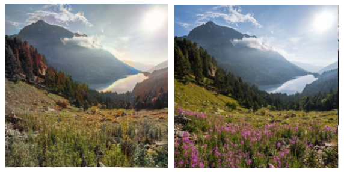
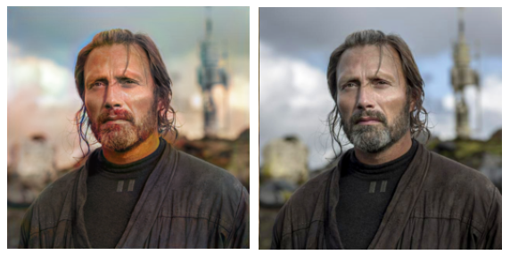
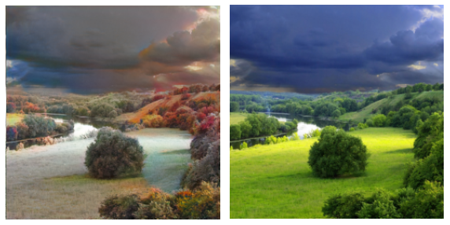
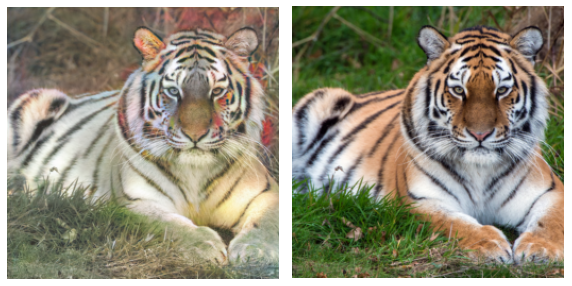
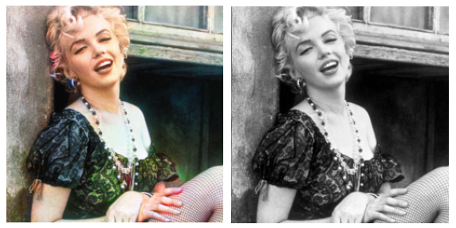

# ColorGAN
***
 GAN for image colorizing

# Overview
***
- Model
- Dataset Flickr30k
- Development environment:

Python 3.7.9

Torch 1.7.0

# Result
***
Model was trained for 15 epochs

Left image is a predicted one, right - ground truth
- Good results

- Bad results

- Performance on old gray images

# TODO

***
- Try augmentations
- Train more epochs
- Implement comfortable prediction code
